# **Trabajos Semanales**

**En esta sección puedes encontrar todos mis trabajos semanales**

---

# **Semana 1**

## **- Syllabus de la materia**

<object data="recursos/archivos/syllabus1.pdf" type="application/pdf" width="100%" height="600">
  
No se pudo mostrar el PDF. <a href="/recursos/archivos/syllabus1pdf">Descargar</a>

</object>

[Syllabus de la materia](recursos/archivos/Syllabus.pdf)

---

# **Semana 2**

## **- Ejercicio 1**

- Descripción: Hicimos una pieza en SolidWorks

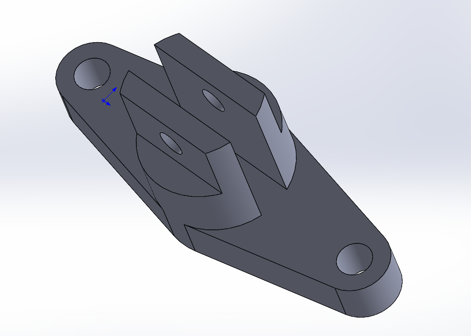

[Ejercicio 1](recursos/archivos/Ejercicio_5.SLDPRT)

---

## **- Ejercicio 2**

- Descripción: Hicimos el Ejercicio 2 en SolidWorks

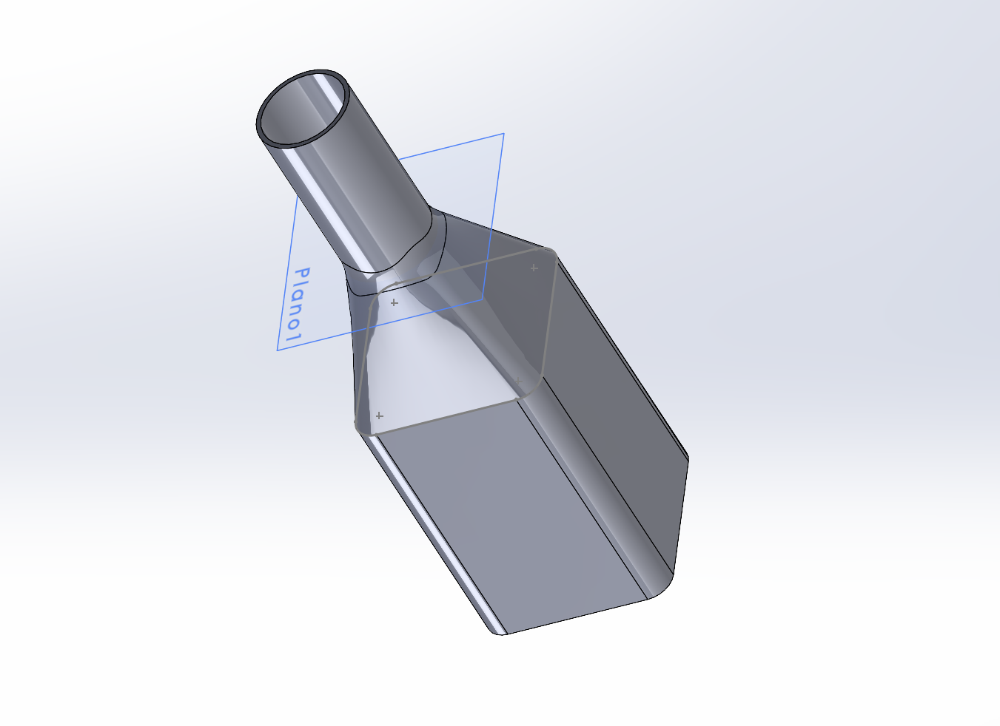

[Ejercicio 2](recursos/archivos/Ejercicio2.SLDPRT)

---

# **Semana 3**

## **- Soporte de Madera**

- Descripción: Utilizamos las maquinas por primera vez e hicimos un soporte de celular de madera

- Durante esa clase el profe nos explico el correcto funcionamiento de cada una de las maquinas que usamos para esta actividad, incluyendo el como prenderlas, las medidas de seguridad adecuadas para cada una y nos permitio a cada uno usarla por nuestra cuenta para probar como funcionabda, tambien nos dio una lista de herramientas y reglas necesarias para trabajr con ellos.

??? info "Equipo y reglas"
    * Bata de laboratorio o overol (Obligatorio) 
    * Botas de casquillo (Obligatorio) 
    * Regla: Quitarse cualquier tipo de joyeria (Obligatorio) 
    * Gafas protectoras 
    * Guantes

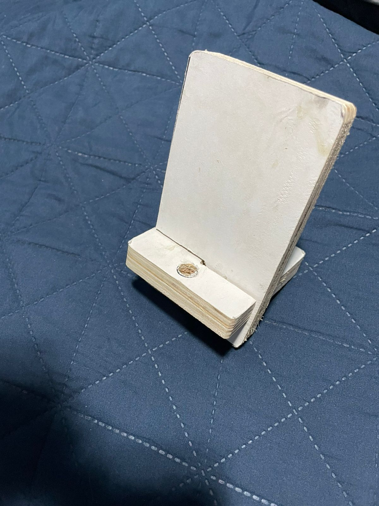

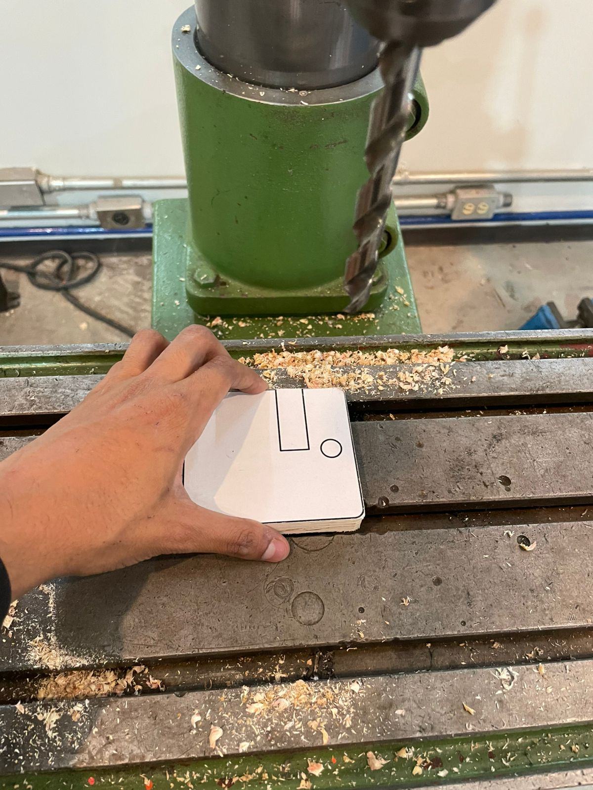

<video controls width="300">
 <source src="./recursos/archivos/Maquina1.mp4" type="video/mp4">
</video>

[Maquina 2](recursos/archivos/Maquina2.mp4)

!!! note "Nota"
    Dsiculpe por no tener video de todas las maquinas, me robaron el cel y perdi muchos de los videos que tenía

---

# **Semana 4**

## **- Ejercicio Florero**

-Descripción: Creación de florero en SolidWorks

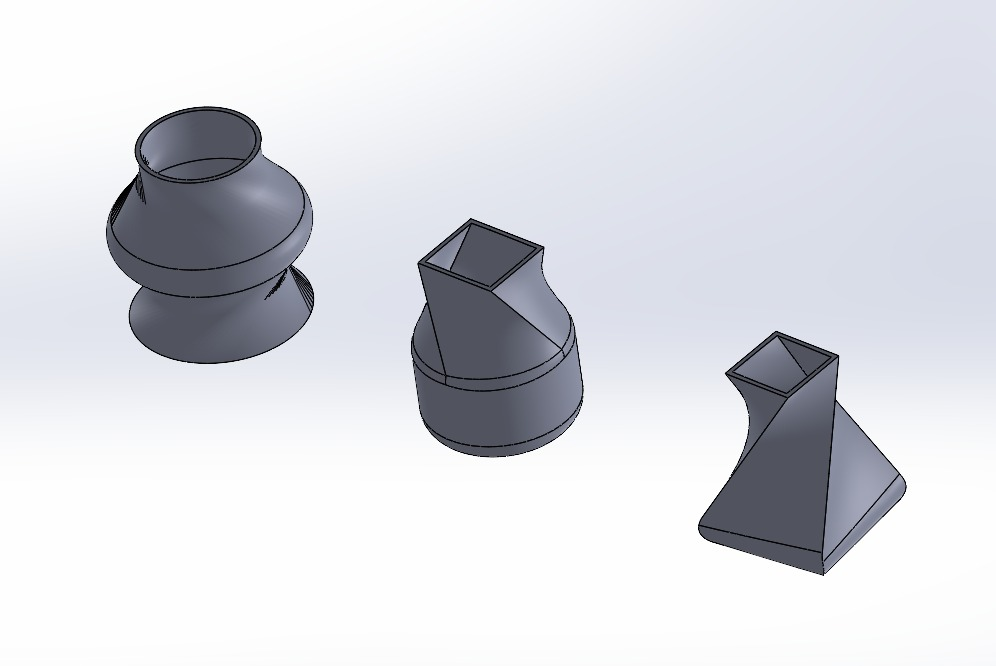
  
[Ejercicio Florero](recursos/archivos/Florero1.SLDPRT)

---

## **- Ejercicio Macetas**

- Descripcion: Creación de Macetas en SolidWorks

  
[Ejercicio Macetas](recursos/archivos/Florero.SLDPRT)

---

## **- Ejercicio 5**

- Descripción: Hicimos el Ejercicio 5 en SolidWorks

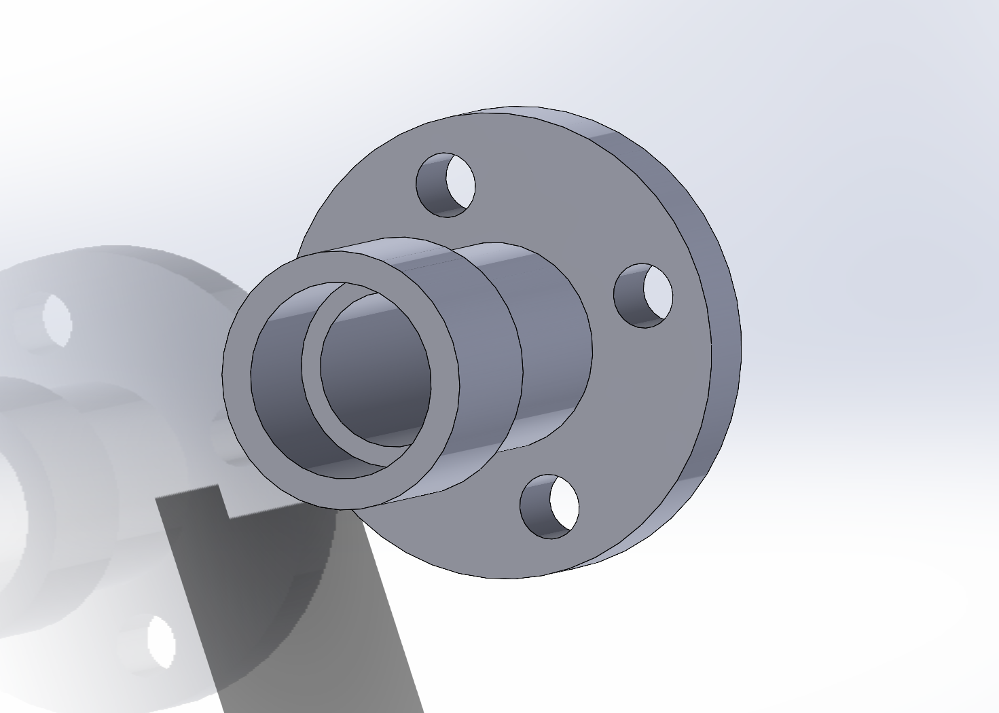

[Ejercicio 5](recursos/archivos/Ejercicio_5.SLDPRT)

# **Semana 5**

## **- Grabado Laser Logo en Soporte de Celular**

- Descripcion: Grabado de Logo en el soporte de Celular realizado la semana pasada

- Con los conocimientos enseñados por nuestro profesor sobre la maquina de corte laser como la menra de prenderla y el uso del software que usaba la maquina, nostros teniamos que haaber dibujado un logo en un plano de solidworks y descargarlo en archivo DXF para luego usando la maquina de corte laser grabar el logo en el soporte de celular hecho en clases pasadas

- Manera correcta de encender la maquina:
  - 1.- Encender el sistema de refrigearcion y extraccion de humo en una palanca azul ubicada debajo de la maquina
  - 2.- Localizar a un costado de la maquina un switch rojo, ponlo en encendido
  - 3.- A un lado del switch busca otro switch de color azul y ponlo en encendido para encender la maquina de corte laser
  - 4.- Por ultimo antes de ralizar un corte busca cerca de la pantalla un boton que diga "Laser 1", si el boton prende luz significa que ya está prendido el laser

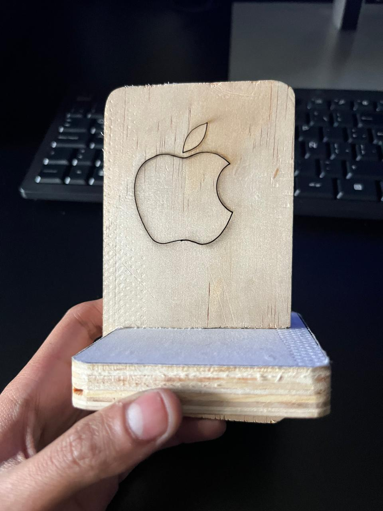
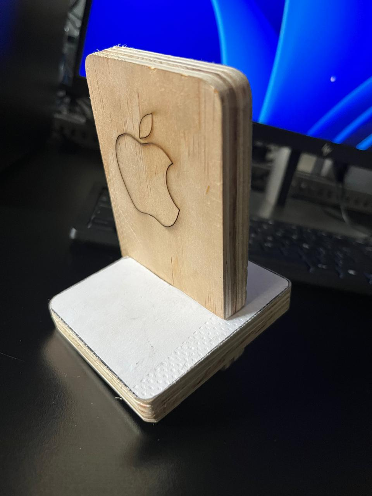

[Archivo del logo en DXF](logocelJoseGil.DXF)

!!! note "Nota"
    Nuevamente pido disculpas por no tener el video de la explicacion de el uso de la maquina, me habian robado el celular

## **- Corte Laser en MDF y ensamble**

- Descripción: Realizar una figura ensamblada por diferentes piezas

- Para esta actividad nuestra tarea era realizar una figura a base ensambles de diferntes piezas cortadas en una tabla de MDF, para esto primero debiamos crear la piezas en 2D en Solidworks y ajustar las medidas para que ensamblara perfectamente, para esta ocasion yo decidi hacer una nave de la saga de peliculas "Star Wars". Una vez ya hechas la piezas en Solidworks procedi a descargarlo en archivo DXF para mandarlo a imprimir en la maquina de corte laser.

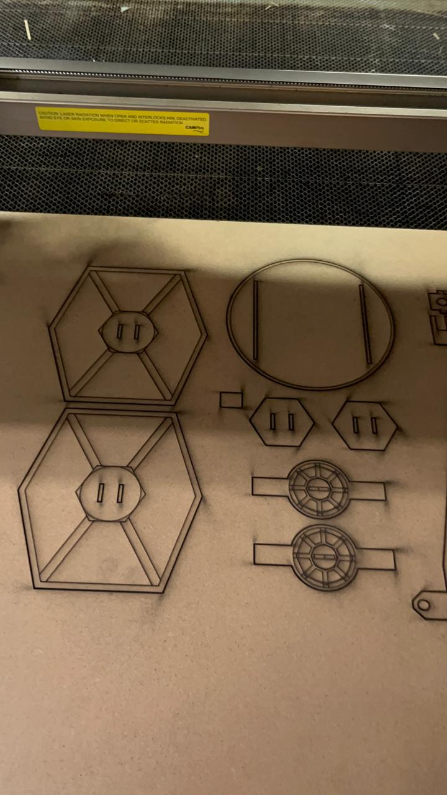
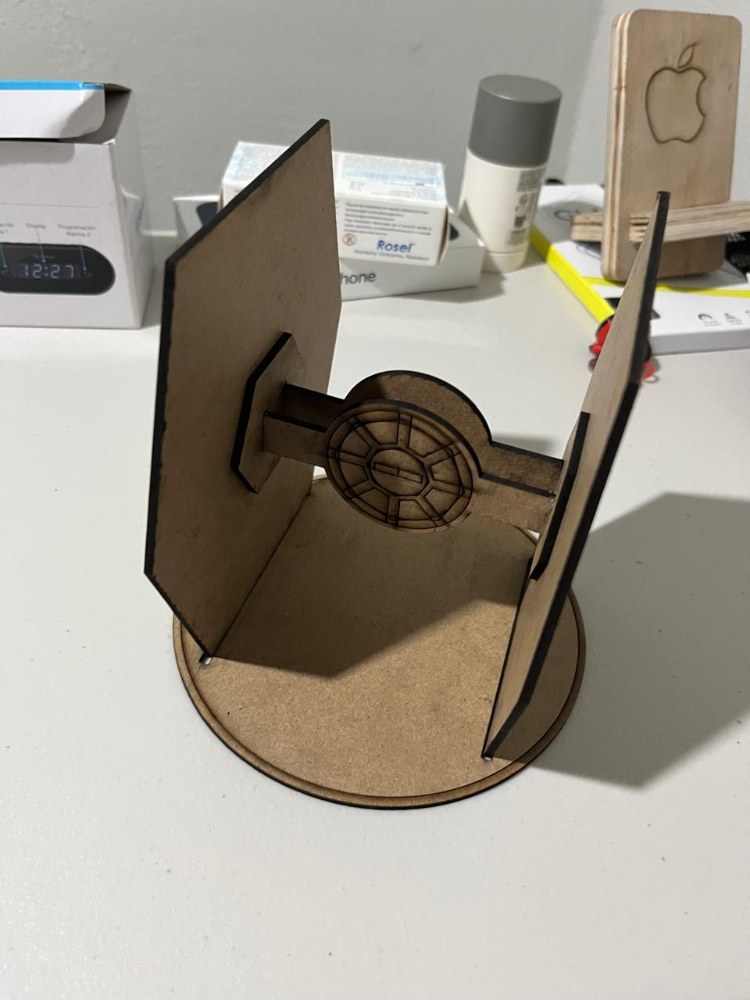
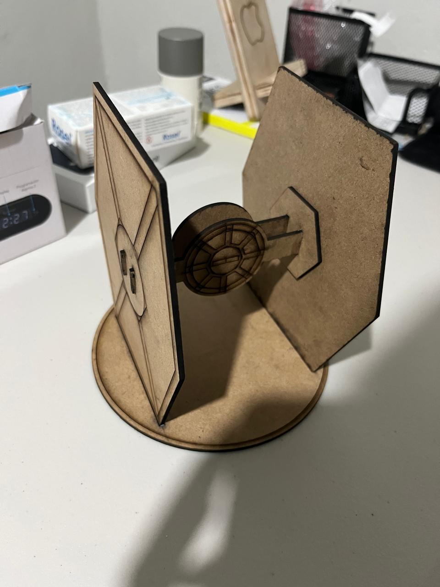

<video controls width="300">
 <source src="./recursos/archivos/videomaquina.mp4" type="video/mp4">
</video>

-[Plano Nave Star Wars en Solid](recursos/archivos/Impresion2d_tarea.SLDPRT)
-[Plano Nave Star Wars en DXF](recursos/archivos/Impresion2d_tarea.DXF)

---

# **Semana 6**

## **- Impresion 3D**

- Descripción: Imprimimos una pieza en 3D

- Para esta actividad la tarea consistia en imprimir una pieza en 3D usando los conocimientos aprendidos sobre las maquinas 3D, como prenderlas, la manera correcta de usarlas, de calibrarlas, de cambiar el filamento, entre otras cosas como descargar u guardar los archivos en la impresora para las impresiones y el software usado para las impresoras llamada "CURA MAKER".
  
- Lo primero que debiamos hacer para esta actividad fue realizar la pieza en un plano de Solidwroks, en mi caso me inspire en querer hacer una especie de maceta con forma de minion o de un personaje para darle mas personalidad a la maceta, una vez terminada mi pieza la descargué en archivo STL.
  
??? info "¿Porque STL?"
    Se descarga en archivo STL porque es el archicvo que hay que usar para poder en el software "Cura Maker" para poder configurar como queremos impirmir nuestra pieza.

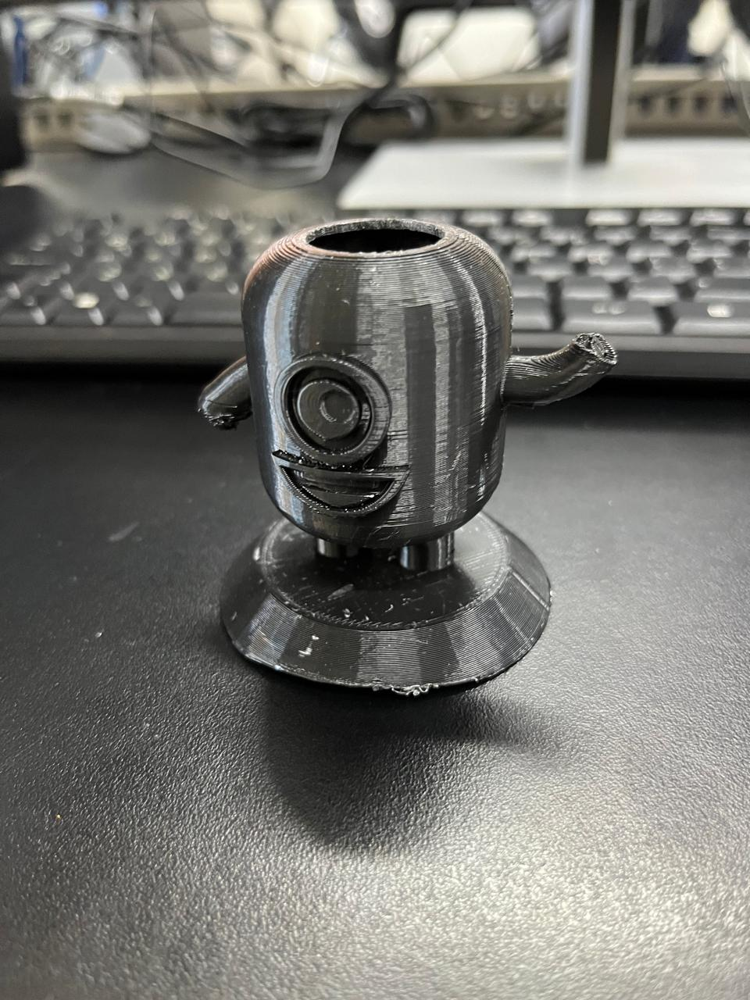
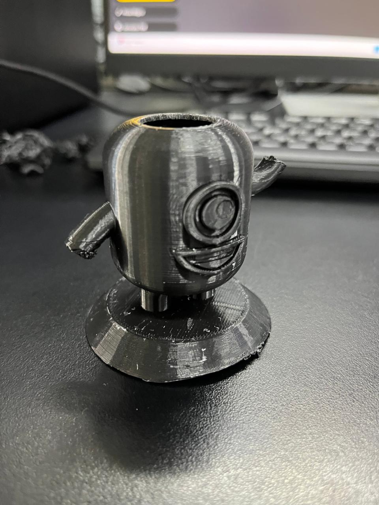
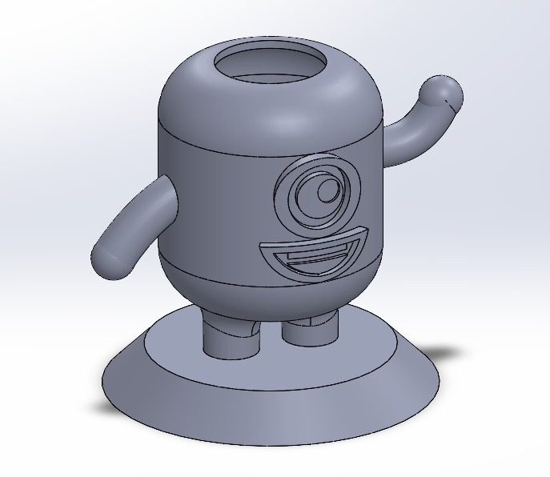

-[Muñeco3D Archivo en Solid](recursos/archivos/Pieza3D.SLDPRT)
-[Muñeco3D Archivo en STL](recursos/archivos/Pieza3D.STL)
-[Muñeco3D Archivo en Gcode](recursos/archivos/CE3S1PRO_Pieza3D_MuñecoGil.gcode)

## **- Curso de 3D**

- Descripcion: Tomamos un cursos introdcutorio sobre las diferentes maquinas que usamos en clase, como la cortadora laser, la mauqina de impresion 3D y los diferentes tipos de escaneo que podemos hacer, a su vez nos esnseñaron sobre la hsitoria y el desarrollo de las maquinas a lo largo del tiempo hasta la actulidad y conceptos sobre la fabricación digital.

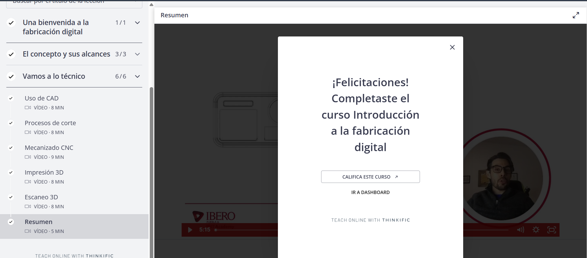
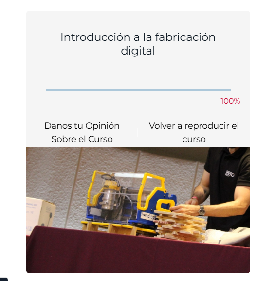

---

# **Semana 7**

## **- Impresion 3D con Gemini**

-Descripción: Impresion de una pieza 3D usando Intelgiencia Artificial

-Con ayuda de la IA de Google llamada Gemini creamos un personaje de acuerdo a nuestros propios gustos, en mi caso fue un mono, una vez gemini genera el personaje descargamos la imagen, luego de eso con la pagina de "Tripo3D", insertamos la imagen en la pagina y esta nos generará un modelo 3D para poder imprimirlo.

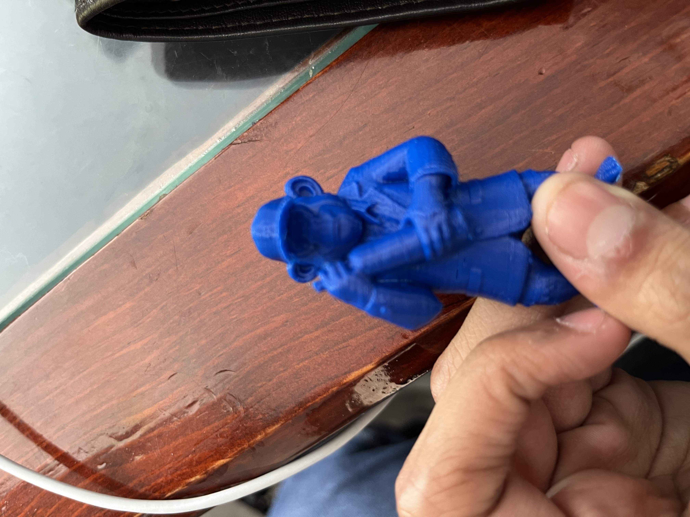
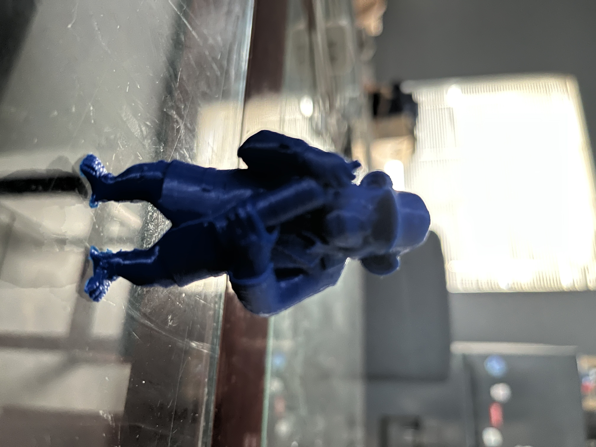

## **- Escaneo con Fotos**

- Descripcion: Escanear un objeto usando el escaneo con fotogrametría

- Para esta tarea tuvimos que invetigar las diferentes aplicaiones existentes para escaneo 3D con fotos y con ayuda o individualmente tomar varias fotos de diferentes perspectivas sobre algun objeto y descargar el archivo del escaneo.

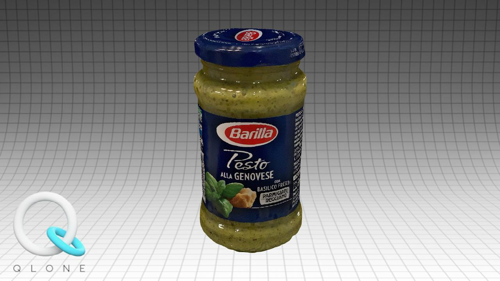

-[Escaneo en Archivo STL](recursos/archivos/escaneoobjeto.stl)

## **- Escaneo de cara**

- Descripcion: Escaneo de cara usando un escaner infrarrojo

- Usando todo lo aprendido sobre el esccaneo 3D y sobre los diferentes escaneres y como funcionan, en esta practica escaneamos nuestra cara usando una escaner infrarrojo, para esto necesitabamos apoyarnos entre compañaeros para aumentar la probabilidad de exito al escanear.

- Para usar el escaner era necesario instalar el software necesario para este llamado "CrealityScan 4" en el que podiamos apreciar como iba el proceso de ecaneo, una vez terminado el escaneo, el software realiza un tipo de procesamiento de malla para tratar de acompletar las partes que no puderion ser escaneadas , una vez terminado ese proceso ya podemos descargarlo en archivo STL en caso de que queramos realizar una impresion 3D.

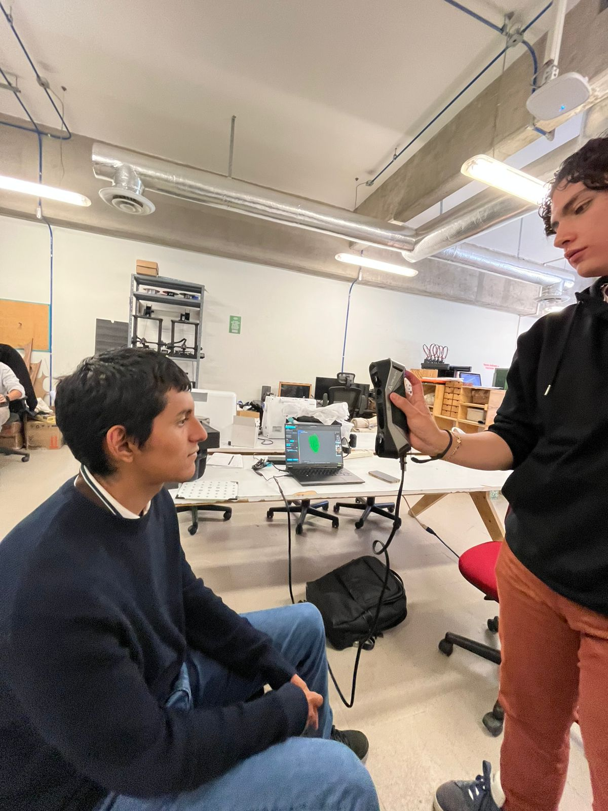
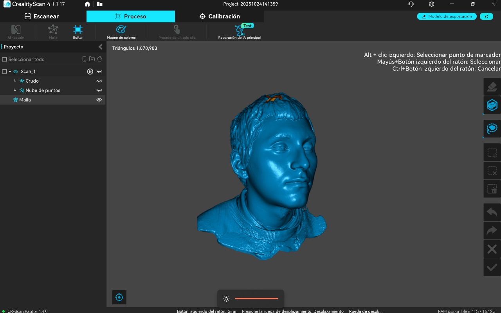

[Escaneo de cara en Archivo STL](recursos/archivos/escaneoobjeto.stl)

## **- Reflexión: ¿Porque es importante el 3D? ¿Cuando usarias el escaner 3D en tu vida?**

- Es la herramienta que nos permite crear, personalizar y reparar objetos. En esencia, nos da el poder de ser los arquitectos de nuestro propio entorno, acelerando la innovación y haciendo mas facil de resolver los problemas cotidianos.
  
- Usaría el escáner 3D para reproducir cualquier pieza que quiera repplicar o quiera creer a partir de mi imaginación. Seria mi herramienta para diseñar y crear todo lo que neceite o desee.

---
# **Semana 8**

## **- Creacion de pieza con lamina de acero**

- Descripcion: Creamos una pieza a base de una lamina de metal usando las diferentes maqi¿uinas del IDIT

- Para esta practica aprendimos a usar una maquina que se utiliza para cortar la lamina y hacerla mas pequeña, esta funcionaba de tal manera que teniamos que insertar la lamina en esta y con fuerza empujar hacia abajo la base que se encontraba enfrente de la maquina, una vez que la base llegara hasta abajo la lamina habra sido cortada.

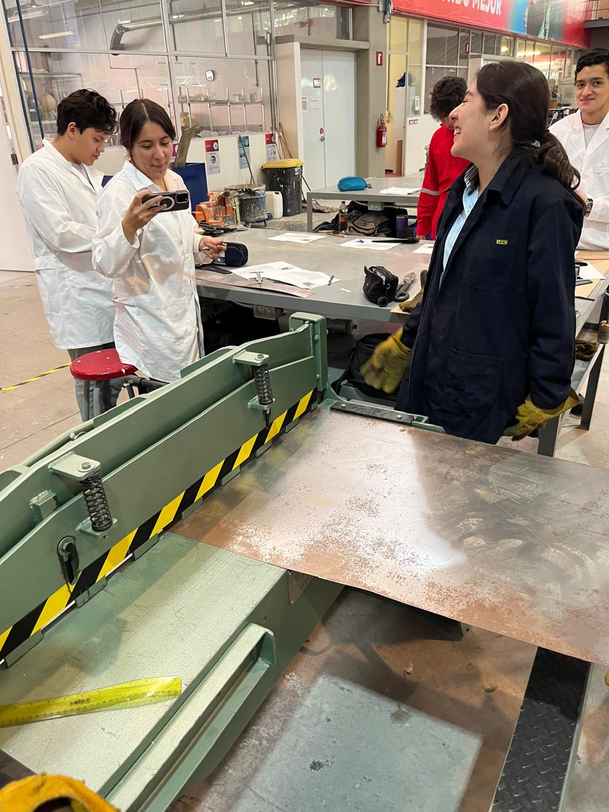

<video controls width="300">
 <source src="./recursos/archivos/laminavideo.mp4" type="video/mp4">
</video>

- Una vez cortada la lamina, con ayuda de un plano entregado por el profesor, trazamos en las diferentes tiras de lamina las medidas necesarias para llevar a cabo nuestra pieza, y una vez terminada de marcar, con unas tijeras y con una maquina diferente cortamos las piezas sobrantes de la lamina para nuestra pieza.

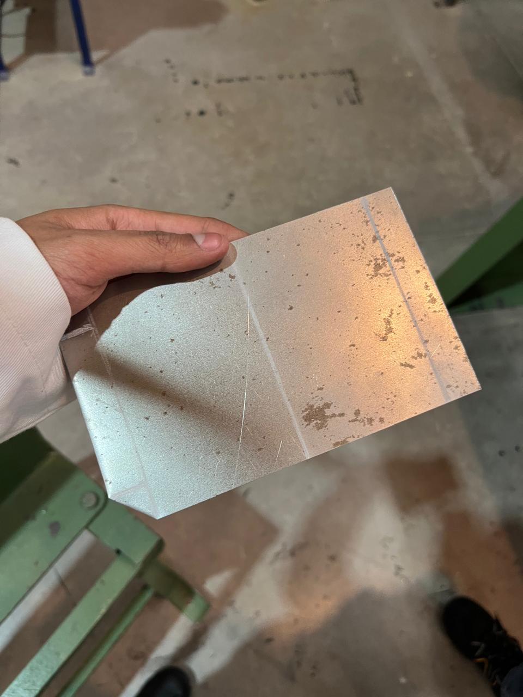
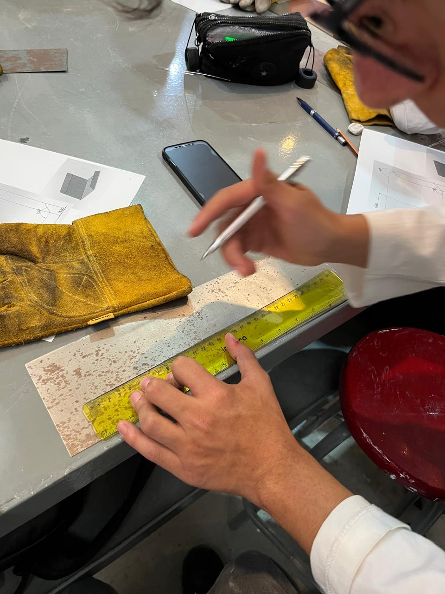
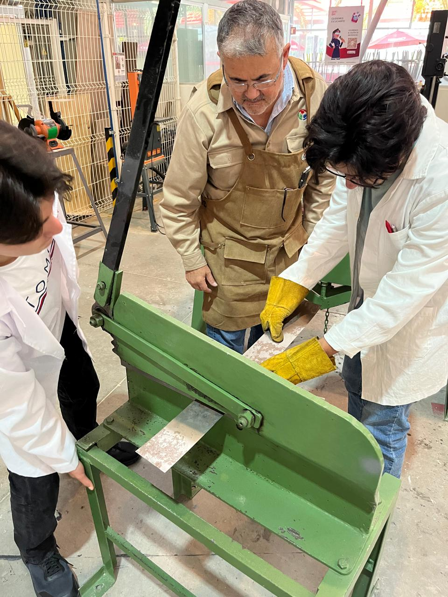

<video controls width="300">
 <source src="./recursos/archivos/videomaquinalamina1.mp4" type="video/mp4">
</video>

- Una vez cortado todo, con otra maquina empezamos a hacer los dobleses necesarios para seguir avanzando con nuestra pieza, y a continuacion con una nueva maquina soldamos una pequeña tira de lamina en nuestra pieza.

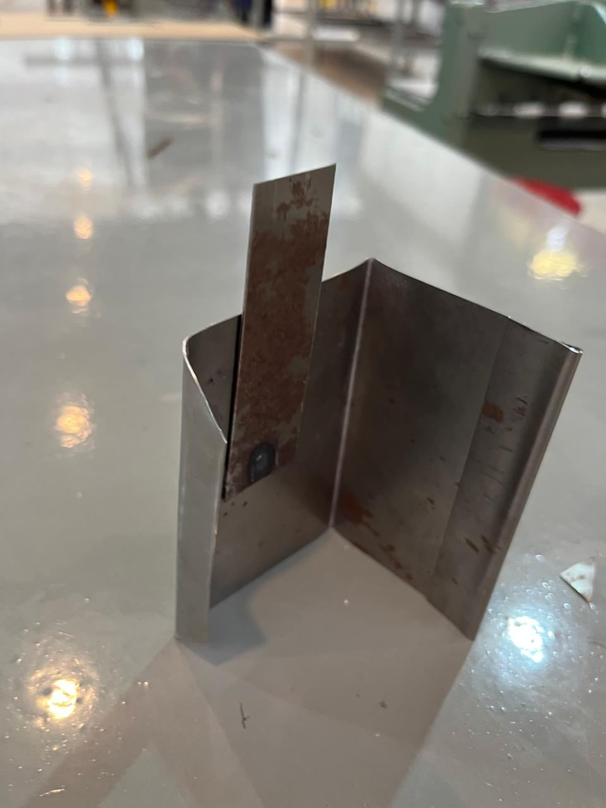

# **Semana 9**

## "Caja con bisagras"

- Descripcion: Hicimos una caja desde 0 con ayuda de las maquinas del IDIT

1. Lo primero que hicimos fue hacer las paredes de la caja cortando una lamina de 15x60cm y marcamos lineas cada 15 en el largo para dividr las cuatro paredes de la caja.

2. Luego doblamos la lamina en 90 grados en cada linea marcada cada 15cm y luego soldamos la ultima y la primera cara o pared para formar la caja con sus paredes.

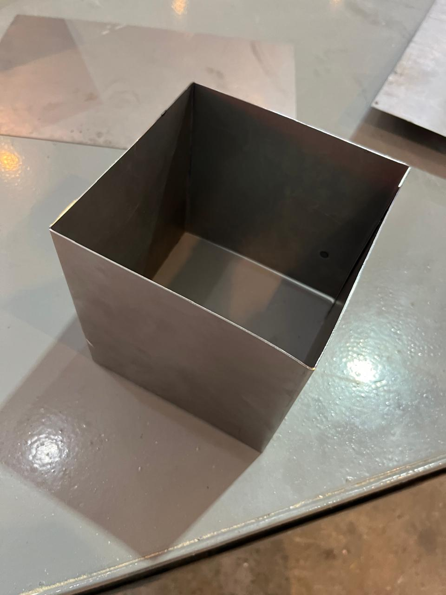

3. Una vez creada la pared creamos la base marcando un cuadrado de 15x15cm y en cada lado le hicimos unas pestañas para soldarlo a las paredes de la caja.

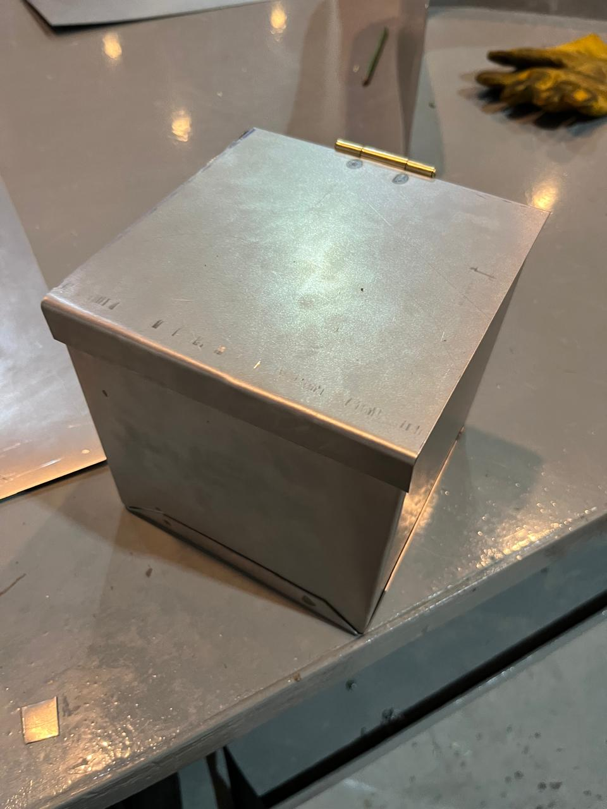

4. Una vez soldada la base con las paredes solo nos quedaba hacer la tapa, para esta use una bisagra soldada a una de las paredes de la caja para poder abirlo y cerrarlo, para hacer la tapa medí un cuadrado de 15x15cm y a un lado de ese le hice una pestaña que funcionara como una agarradera para abrir mas facil la caja.

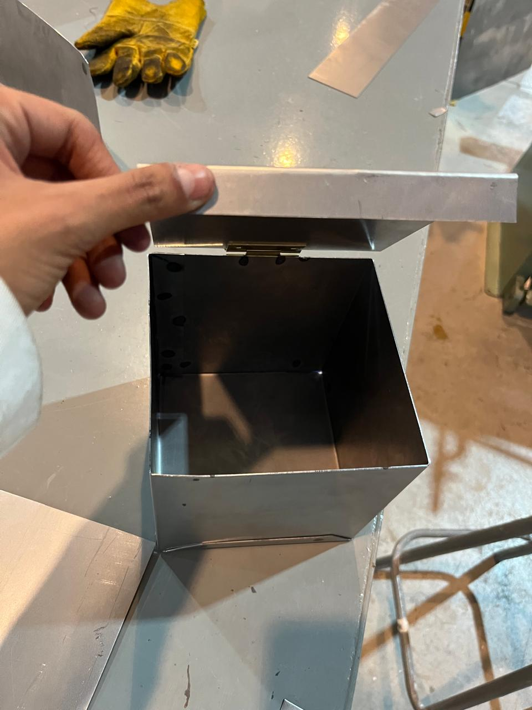
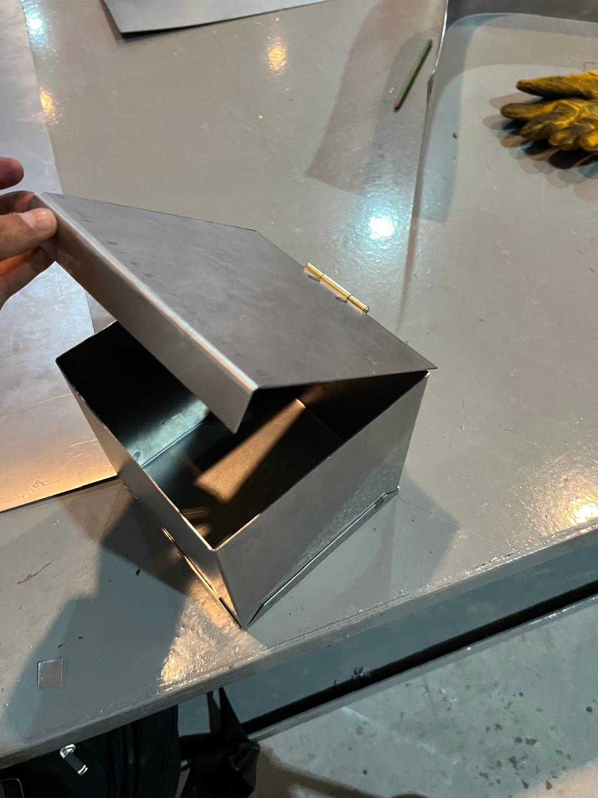

<video controls width="300">
 <source src="./recursos/archivos/cajavideo.mp4" type="video/mp4">
</video>

---

# **Semana 10**

## "Creacion de Matriz para molde"

- Descripción: En Solidworks creamos una matriz de alguna pieza de nuesyra elección para poder crear un molde de aquella pieza. El procesos consistía en crear unas matrices de cada mitad de una pieza (importante que tuviera una entrada de aire) , para luego con el router CNC crear las matrices en espuma rosa para luego juntar las dos mitades y a travez de un orificio (no la entrada del aire) que debimos crear en Solidworks previamente, luego encima de la matriz hechamos una mezcla y esperamos a que endureza, una vez listo ya tendriamos los moldes de nuestra pieza.

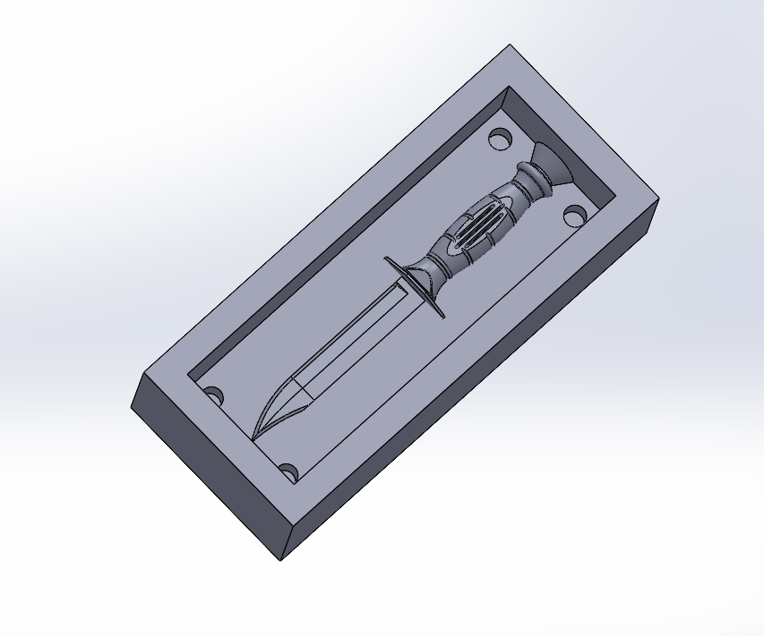
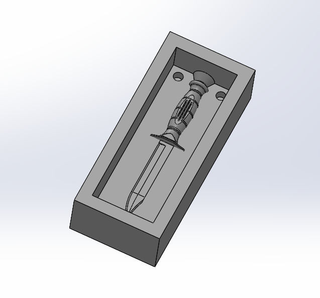

[Parte 1 de la Matriz](recursos/archivos/Matriz1.SLDPRT)
[Parte 2 de la Matriz](recursos/archivos/Matriz2.SLDASM)

---

# **Semana 11**

## "Tabla de madera para la casa-Router CNC"

- Descripción: Con un nuevo programa llamada Vcarve en la que diseñamos los vectores para crear una tabla de madera con un RouterCNC, el proceso consistio en hacer el diseño de la tabla en Solid para luego descargarlo en DXF y luego lo pasamos a Vcarve donde configuramos todos lo cortes que queriamos para la tabla, luego de eso creamos los codigos que debiamos introducir a la CNC para que cortara la tabla correctamente.
 

<video controls width="300">
 <source src="./recursos/archivos/VideoCNC.mp4" type="video/mp4">
</video>

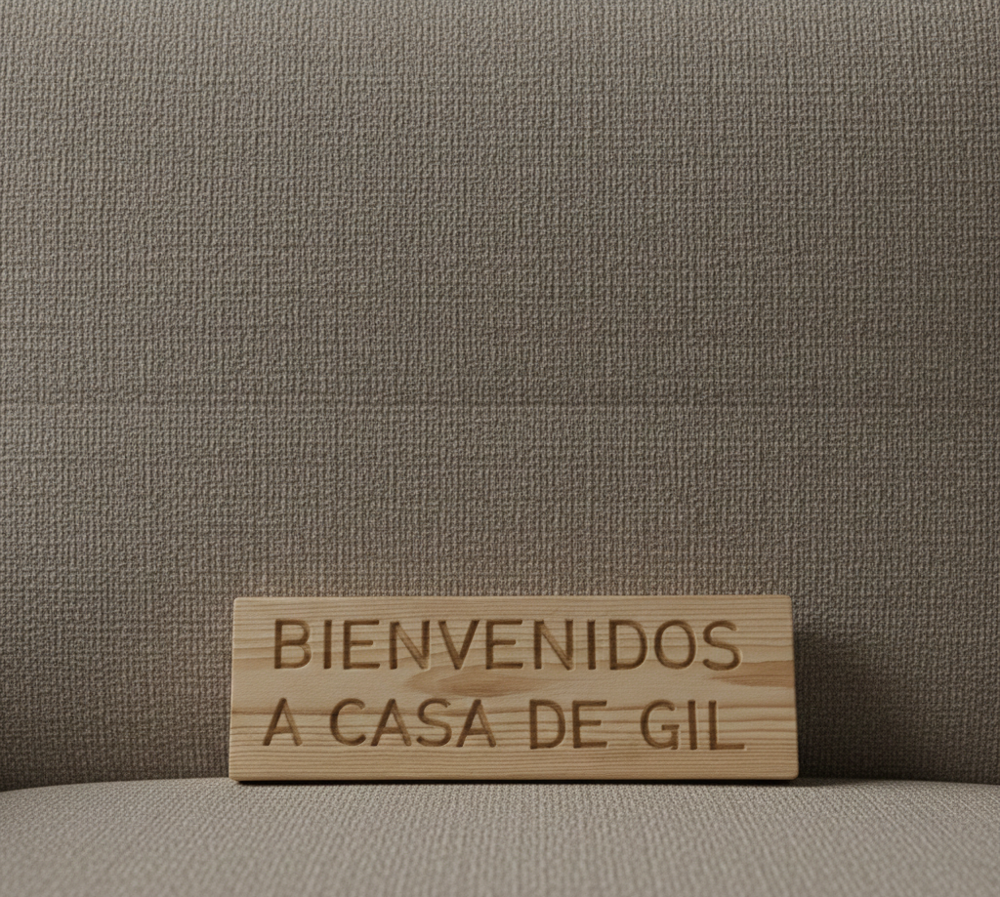

---

# **Semana 12**

## "Ejercicio Solidwork"

- Descripcion: Entrega de los 40 Ejercicio de Solidwork enviados por el profesor.
  
1.- Ejercicio1

[Ejercicio 1](recursos/archivos/Ejercicio1.SLDPRT)

[Ejercicio 2](recursos/archivos/Ejercicio2(2).SLDPRT)

[Ejercicio 3](recursos/archivos/Ejercicio3.SLDPRT)

[Ejercicio 4](recursos/archivos/Ejercicio4.SLDPRT)

[Ejercicio 5](recursos/archivos/Ejercicio5.SLDPRT)

[Ejercicio 6](recursos/archivos/Ejercicio6.SLDPRT)

[Ejercicio 7](recursos/archivos/Ejercicio7.SLDPRT)

[Ejercicio 8](recursos/archivos/Ejercicio8.SLDPRT)

[Ejercicio 9](recursos/archivos/Ejercicio9.SLDPRT)

[Ejercicio 10](recursos/archivos/Ejercicio10.SLDPRT)

