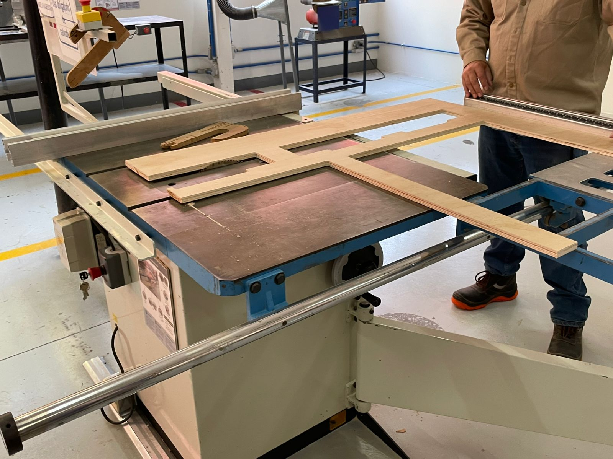

# **Trabajos Semanales**

**En esta sección puedes encontrar todos mis trabajos semanales**

## **Ejercicio 1**

- Descripción: Hicimos una pieza en SolidWorks

[Ejercicio 1](recursos/archivos/Ejercicio_5.SLDPRT)

---

## **Ejercicio 2**

- Descripción: Hicimos el Ejercicio 2 en SolidWorks

[Ejercicio 2](recursos/archivos/Ejercicio2.SLDPRT)

---

## **Soporte de Madera**

- Descripción: Utilizamos las maquinas por primera vez e hicimos un soporte de celular de madera 

---

## **Ejercicio Floreros**

- Descripcion: Creación de floreros en SolidWorks

  
[Ejercicio Floreros](recursos/archivos/Florero.SLDPRT)

---

## **Ejercicio 5**

- Descripción: Hicimos el Ejercicio 5 en SolidWorks

[Ejercicio 5](recursos/archivos/Ejercicio_5.SLDPRT)

