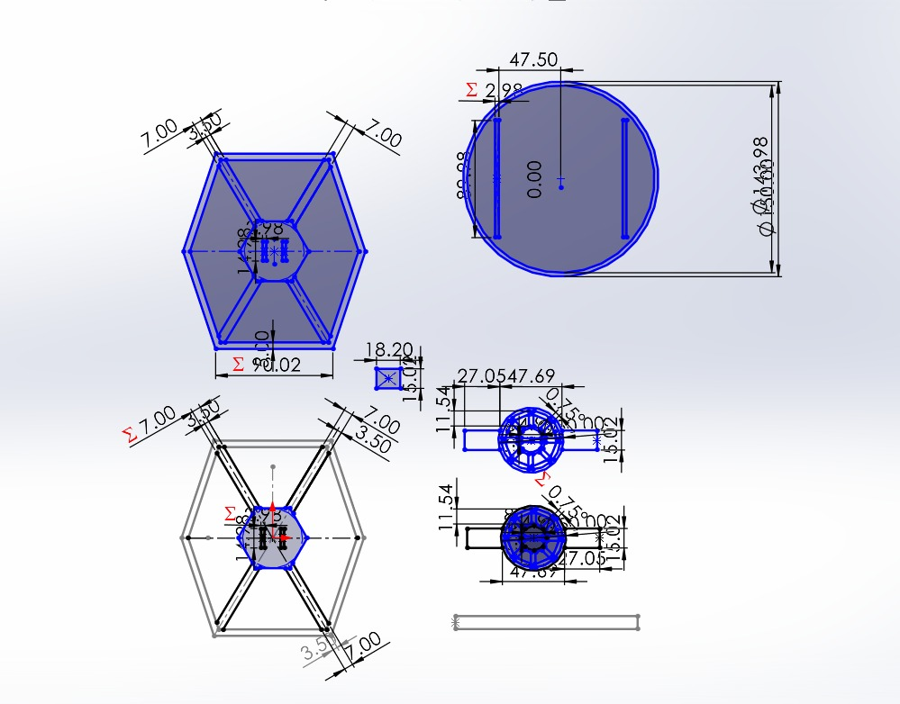

# **Trabajos Semanales**

**En esta sección puedes encontrar todos mis trabajos semanales**

---

# **Semana 1**

## **- Syllabus de la materia**

<object data="recursos/archivos/syllabus1.pdf" type="application/pdf" width="100%" height="600">
  
No se pudo mostrar el PDF. <a href="/recursos/archivos/syllabus1pdf">Descargar</a>

</object>

[Syllabus de la materia](recursos/archivos/Syllabus.pdf)

---

# **Semana 2**

## **- Ejercicio 1**

- Descripción: Hicimos una pieza en SolidWorks

[Ejercicio 1](recursos/archivos/Ejercicio_5.SLDPRT)

---

## **- Ejercicio 2**

- Descripción: Hicimos el Ejercicio 2 en SolidWorks

[Ejercicio 2](recursos/archivos/Ejercicio2.SLDPRT)

---

# **Semana 3**

## **- Soporte de Madera**

- Descripción: Utilizamos las maquinas por primera vez e hicimos un soporte de celular de madera

- Durante esa clase el profe nos explico el correcto funcionamiento de cada una de las maquinas que usamos para esta actividad, incluyendo el como prenderlas, las medidas de seguridad adecuadas para cada una y nos permitio a cada uno usarla por nuestra cuenta para probar como funcionabda, tambien nos dio una lista de herramientas y reglas necesarias para trabajr con ellos, siendo estos:

  * Bata de laboratorio o overol (Obligatorio)
  * Botas de casquillo (Obligatorio)
  * Regla: Quitarse cualquier tipo de joyeria (Obligatorio)
  * Gafas protectoras
  * Guantes

[Video de Maquinas](recursos/archivos/Maquina1.mp4)
[Maquina 2](recursos/archivos/Maquina2.mp4)

!!! note "Nota"
    Dsiculpe por no tener video de todas las maquinas, me robaron el cel y perdi muchos de los videos que tenía

---

# **Semana 4**

## **- Ejercicio Florero**

-Descripción: Creación de florero en SolidWorks

  
[Ejercicio Florero](recursos/archivos/Florero1.SLDPRT)

---

## **- Ejercicio Macetas**

- Descripcion: Creación de Macetas en SolidWorks

  
[Ejercicio Macetas](recursos/archivos/Florero.SLDPRT)

---

## **- Ejercicio 5**

- Descripción: Hicimos el Ejercicio 5 en SolidWorks

[Ejercicio 5](recursos/archivos/Ejercicio_5.SLDPRT)

# **Semana 5**

## **- Grabado Laser Logo en Soporte de Celular**

- Descripcion: Grabado de Logo en el soporte de Celular realizado la semana pasada

- Con los conocimientos enseñados por nuestro profesor sobre la maquina de corte laser como la menra de prenderla y el uso del software que usaba la maquina, nostros teniamos que haaber dibujado un logo en un plano de solidworks y descargarlo en archivo DXF para luego usando la maquina de corte laser grabar el logo en el soporte de celular hecho en clases pasadas

- Manera correcta de encender la maquina:
  * 1.- Encender el sistema de refrigearcion y extraccion de humo en una palanca azul ubicada debajo de la maquina
  * 2.- Localizar a un costado de la maquina un switch rojo, ponlo en encendido
  * 3.- A un lado del switch busca otro switch de color azul y ponlo en encendido para encender la maquina de corte laser
  * 4.- Por ultimo antes de ralizar un corte busca cerca de la pantalla un boton que diga "Laser 1", si el boton prende luz significa que ya está prendido el laser

[Archivo del logo en DXF](logocelJoseGil.DXF)

!!! note "Nota"
    Nuevamente pido disculpas por no tener el video de la explicacion de el uso de la maquina, me habian robado el celular

## **- Corte Laser en MDF y ensamble**

- Descripción: Realizar una figura ensamblada por diferentes piezas

- Para esta actividad nuestra tarea era realizar una figura a base ensambles de diferntes piezas cortadas en una tabla de MDF, para esto primero debiamos crear la piezas en 2D en Solidworks y ajustar las medidas para que ensamblara perfectamente, para esta ocasion yo decidi hacer una nave de la saga de peliculas "Star Wars". Una vez ya hechas la piezas en Solidworks procedi a descargarlo en archivo DXF para mandarlo a imprimir en la maquina de corte laser.

-[Video del uso de la maquina](recursos/archivos/videomaquina.mp4)
-[Plano Nave Star Wars en Solid](recursos/archivos/Impresion2d_tarea.SLDPRT)
-[Plano Nave Star Wars en DXF](recursos/archivos/Impresion2d_tarea.DXF)

---

# **Semana 6**

## **- Impresion 3D**

- Descripción: Imprimimos una pieza en 3D

- Para esta actividad la tarea consistia en imprimir una pieza en 3D usando los conocimientos aprendidos sobre las maquinas 3D, como prenderlas, la manera correcta de usarlas, de calibrarlas, de cambiar el filamento, entre otras cosas como descargar u guardar los archivos en la impresora para las impresiones y el software usado para las impresoras llamada "CURA MAKER".
  
- Lo primero que debiamos hacer para esta actividad fue realizar la pieza en un plano de Solidwroks, en mi caso me inspire en querer hacer una especie de maceta con forma de minion o de un personaje para darle mas personalidad a la maceta, una vez terminada mi pieza la descargué en archivo STL.
  ??? info "¿Porque STL?"
    Se descarga en archivo STL porque es el archicvo que hay que usar para poder en el software "Cura Maker" para poder configurar como queremos impirmir nuestra pieza.

-[Muñeco3D Archivo en Solid](recursos/archivos/Pieza3D.SLDPRT)
-[Muñeco3D Archivo en STL](recursos/archivos/Pieza3D.STL)
-[Muñeco3D Archivo en Gcode](recursos/archivos/CE3S1PRO_Pieza3D_MuñecoGil.gcode)

## **- Curso de 3D**

- Descripcion: Tomamos un cursos introdcutorio sobre las diferentes maquinas que usamos en clase, como la cortadora laser, la mauqina de impresion 3D y los diferentes tipos de escaneo que podemos hacer, a su vez nos esnseñaron sobre la hsitoria y el desarrollo de las maquinas a lo largo del tiempo hasta la actulidad y conceptos sobre la fabricación digital.

---

# **Semana 7**

## **- Impresion 3D con Gemini**

-Descripción: Impresion de una pieza 3D usando Intelgiencia Artificial

-Con ayuda de la IA de Google llamada Gemini creamos un personaje de acuerdo a nuestros propios gustos, en mi caso fue un mono, una vez gemini genera el personaje descargamos la imagen, luego de eso con la pagina de "Tripo3D", insertamos la imagen en la pagina y esta nos generará un modelo 3D para poder imprimirlo.

## **- Escaneo con Fotos**

- Descripcion: Escanear la cara usando el escaneo con fotogrametría

- Para esta tarea tuvimos que invetigar las diferentes aplicaiones existentes para escaneo 3D con fotos y con ayuda o individaulmente tomar varias fotos de diferentes perspectivas sobre nuestra cabeza y descargar el archivo del escaneo.

## **- Escaneo e impresion de cara**

- Descripcion: Escaneo de cara

## **- Reflexión: ¿Porque es importante el 3D? ¿Cuando usarias el escaner 3D en tu vida?**

- Es la herramienta que nos permite crear, personalizar y reparar objetos. En esencia, nos da el poder de ser los arquitectos de nuestro propio entorno, acelerando la innovación y haciendo mas facil de resolver los problemas cotidianos.
  
- Usaría el escáner 3D para reproducir cualquier pieza que quiera repplicar o quiera creer a partir de mi imaginación. Seria mi herramienta para diseñar y crear todo lo que neceite o desee.

## **- Creacoin de pieza con lamina de acero**

